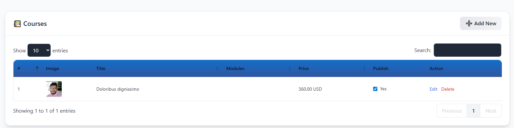

# Soft Course 🎓

📄 For detailed documentation, please visit:  
[Google Docs Link](https://docs.google.com/document/d/1FP5s-sI_pZK77Wj_PrvnBFeeO8xUgKsymHRq46jwEyw/edit?usp=sharing)

🎦 For Video Demonstration, please visit:  
[Google Drive Link](https://drive.google.com/file/d/1jJXD1fAsiINYDLAgZugmLLfZufJpd36B/view)


---

A modular LMS-type project built with **Laravel**.  
Structure: **Courses → Modules → Polymorphic Content**.  
Authentication, Levels, and Categories built in.  

---

## Caution 
In case there is a problem with public/build folder, 
use z_extra/build as substitude.

## Requirements
- **system**
  - Composer version 2.8.6
  - mysqli_pdo (XAMPP->php.ini)
  - PHP >= php 8.2.12 
  - nodejs v22.14.0 (my system)
  - npm v10.9.2 (my system)
  
## Features

- **EDGE**
  - tailwind css
  - Yajra Datatables
  - Trix Text Editor
  - Authentication, Authorization
  - Polymorphic Relations
  - Scalable Architechture
  - Separate Request hook per feature
  - Dynamic Components

- **Courses**  
  - Create unlimited courses.  
  - Each course can have many **modules**.  
  - Courses have **level** and **category** dependencies.  
  - Authentication & authorization included (only logged-in users can manage content).  

- **Modules**  
  - Nested under courses.  
  - Unlimited modules per course.  

- **Content (Polymorphic)**  
  - Nested under modules.  
  - Content can be of different types (currently **Video**), with ability to extend (e.g. Text, Quiz, Audio, etc.).  
  - Videos have fields like `title`, `source_type`, `url`, `length_in_seconds`.  

- **Demo User Seeded**  
  - There is a seeder that creates a demo user:  
    - **Email**: `admin@gmail.com`  
    - **Password**: `Soft123`  

- **Extra Assets Folder**  
  - The `z_extra` folder holds an extra `manifest.json` and CSS to help resolve npm/build-related issues.  

---

## Database Schema Overview  

Below is an Entity-Relationship sketch showing how the major tables relate (add an image here):  

  

---

## Screenshots  

(Add your own screenshots here to illustrate the app in action.)  

- Access  
    

- Courses Page  
    

- Module Creation  
    

---

## Installation

```bash
# 1. Clone the repository
git clone https://github.com/Moskov-1/soft_course.git
cd soft_course

# 2. Install PHP dependencies
composer install

# 3. Install Node dependencies
npm install
npm run build   # or npm run dev

# 4. Set up environment
cp .env.example .env
php artisan key:generate

# 5. Run migrations and seeders
php artisan migrate:fresh --seed

# 6. Start the server
php artisan serve

```
## TroubleShooting 
In case there is a problem with public/build folder, 
use z_extra/build as substitude.